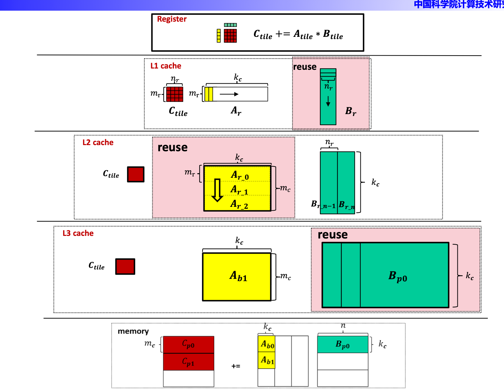
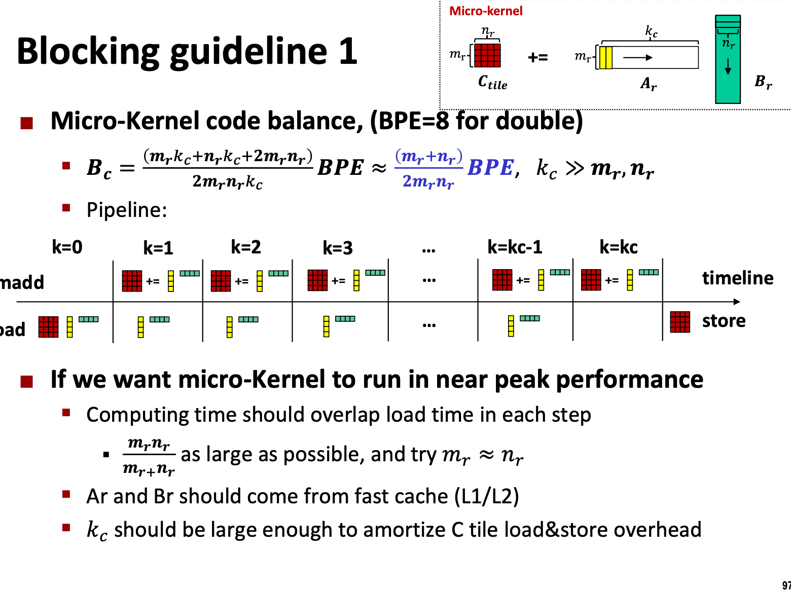
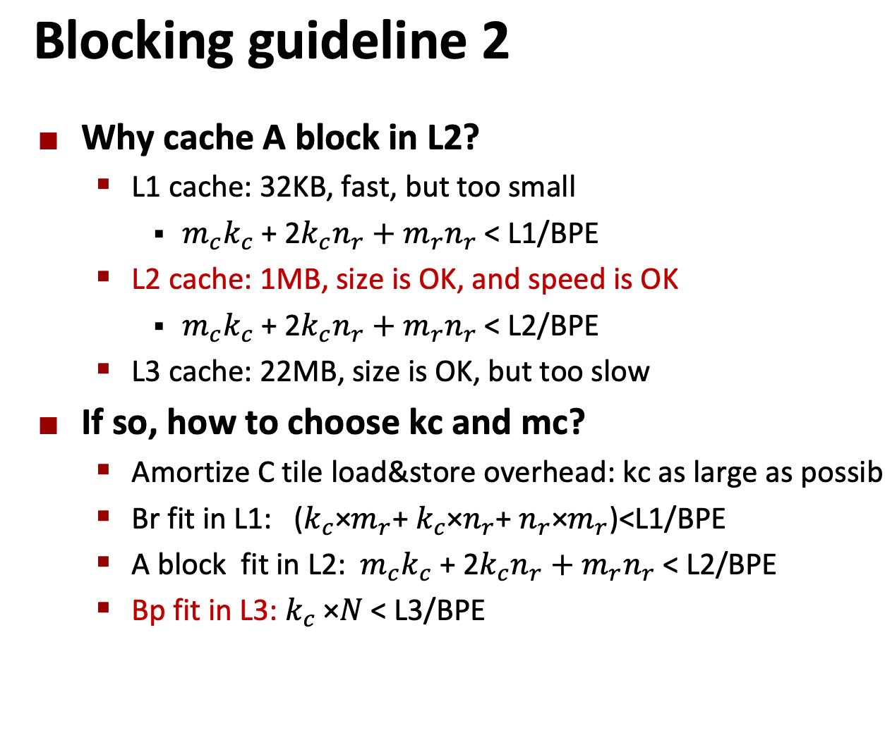

## mnk     constexpr int m = 4000, n =16000, k =128;
- [ x ]  -O3 大概可以是5倍提升
```txt
    ➜  build make && ./tsmm 
    Consolidate compiler generated dependencies of target tsmm
    [ 50%] Building CXX object CMakeFiles/tsmm.dir/tsmm.cpp.o
    [100%] Linking CXX executable tsmm
    [100%] Built target tsmm
    Timer: naive
    Duration: 29170.8 ms
    FLOPS: 5.61657e+08 GFLOPS
    M: 4000, N: 16000, K: 128
```
- [   ] 规范blas接口
- [   ] JIT的手法 可以吗？
- [  x ] simd
- [   ] 多线程
- [   ] 预取
- [ ] tunning 进一步找到最好的组合
- [   ] 要有 


Theoretically, Ryzen 9700X can perform 32 FLOP per cycle: 8 (floats in YMM register) * 2 (add + mul) * 2 (1/TP). Therefore, the theoretical peak FLOPS in single-threaded mode can be roughly estimated as CPU_CLOCK_SPEED * 32 or n_cores * CPU_CLOCK_SPEED * 32 in multi-threaded mode. For example, assuming a sustainable clock speed of 4.7 GHz for an 8-core 9700X processor, the theoretical peak FLOPS in a multi-threaded setting would be 1203 FLOPS.


## Opt
### Order 的探索
Timer: reorderikj
Duration: 3231.51 ms
FLOPS: 5.07007e+09 GFLOPS
M: 4000, N: 16000, K: 128
----------------------------------------
Timer: reorderkij
Duration: 108059 ms
FLOPS: 1.51621e+08 GFLOPS
M: 4000, N: 16000, K: 128

ikj 明显大于 kji

但是其实没有意义，我们后续要考虑在block中的order ， block之间和block之内的差别也很重
### Prefetch 要做

### Simd


The last thing we need to discuss before implementing the kernel in C is how to choose the kernel size i.e. mR
 and nR
. CPUs with AVX support have 16 YMM registers. From our previous discussion, we know that we need (mR/8)⋅nR
 registers to store the accumulator C¯
, mR/8
 registers to store the column vector and 1 register (because we can reuse the same register for all FMA operations) for the broadcasted vector. We want mR
 and nR
 to be as large as possible while satisfying the following conditions:

(mR8⋅nR+mR8+1)<=16
mR
 is a multiple of 8
In theory we want mR=nR
 to minimize the number of fetched elements. However, in practice, a non-square kernel with mR=16,nR=6
 showed the best performance on my CPU. Therefore, we will implement this kernel in the next section. Feel free to experiment with other kernel sizes, such as 8×8,8×12
, 8×13
, 8×14
, 32×2
 and compare their performance on your CPU.
### OpenMP

### 

## reference 
https://github.com/flame/how-to-optimize-gemm/wiki#the-gotoblasblis-approach-to-optimizing-matrix-matrix-multiplication---step-by-step
https://salykova.github.io/matmul-cpu


## cache 
Model name:             Intel(R) Xeon(R) Gold 6430R CPU @ 2.80GHz
CPU family:              6
Caches (sum of all):      
  L1d:                    3 MiB (64 instances)
  L1i:                    2 MiB (64 instances)
  L2:                     128 MiB (64 instances)
  L3:                     120 MiB (2 instances)

  
## Block Mr Nr 

为了cache 放的下所以需要block ，由于cache size和 M K 有关所以需要去 切成Mc Kc

## pack 是为了解决TLB的问题
原先的load 方式，对于A我们需要load 按列有8个数据 然后在k方向继续，不pack的话就是回我第一个度的数据在第一个page， 第二个数据在第二个page，所以这时候我们需要让他重新排布一下，可能连着的好几个数据就在相同的page里面，就可以减少TLBmiss ， 那么对于B也可以pack

## 之后就Prefetch

## micro
```cpp

#include "immintrin.h"
#define A(i,j) A[(i)+(j)*LDA]
#define B(i,j) B[(i)+(j)*LDB]
#define C(i,j) C[(i)+(j)*LDC]

void scale_c_k7(double *C,int M, int N, int LDC, double scalar){
    int i,j;
    for (i=0;i<M;i++){
        for (j=0;j<N;j++){
            C(i,j)*=scalar;
        }
    }
}

void mydgemm_cpu_opt_k7(int M, int N, int K, double alpha, double *A, int LDA, double *B, int LDB, double beta, double *C, int LDC){
    int i,j,k;
    if (beta != 1.0) scale_c_k7(C,M,N,LDC,beta);
    for (i=0;i<M;i++){
        for (j=0;j<N;j++){
            double tmp=C(i,j);
            for (k=0;k<K;k++){
                tmp += alpha*A(i,k)*B(k,j);
            }
            C(i,j) = tmp;
        }
    }
}

#define KERNEL_K1_8x4_avx2_intrinsics\
    a0 = _mm256_mul_pd(valpha, _mm256_loadu_pd(&A(i,k)));\
    a1 = _mm256_mul_pd(valpha, _mm256_loadu_pd(&A(i+4,k)));\
    b0 = _mm256_broadcast_sd(&B(k,j));\
    b1 = _mm256_broadcast_sd(&B(k,j+1));\
    b2 = _mm256_broadcast_sd(&B(k,j+2));\
    b3 = _mm256_broadcast_sd(&B(k,j+3));\
    c00 = _mm256_fmadd_pd(a0,b0,c00);\
    c01 = _mm256_fmadd_pd(a1,b0,c01);\
    c10 = _mm256_fmadd_pd(a0,b1,c10);\
    c11 = _mm256_fmadd_pd(a1,b1,c11);\
    c20 = _mm256_fmadd_pd(a0,b2,c20);\
    c21 = _mm256_fmadd_pd(a1,b2,c21);\
    c30 = _mm256_fmadd_pd(a0,b3,c30);\
    c31 = _mm256_fmadd_pd(a1,b3,c31);\
    k++;

void mydgemm_cpu_v7(int M, int N, int K, double alpha, double *A, int LDA, double *B, int LDB, double beta, double *C, int LDC){
    int i,j,k;
    if (beta != 1.0) scale_c_k7(C,M,N,LDC,beta);
    int M8=M&-8,N4=N&-4,K4=K&-4;
    __m256d valpha = _mm256_set1_pd(alpha);//broadcast alpha to a 256-bit vector
    __m256d a0,a1,b0,b1,b2,b3;
    for (i=0;i<M8;i+=8){
        for (j=0;j<N4;j+=4){
            __m256d c00 = _mm256_setzero_pd();
            __m256d c01 = _mm256_setzero_pd();
            __m256d c10 = _mm256_setzero_pd();
            __m256d c11 = _mm256_setzero_pd();
            __m256d c20 = _mm256_setzero_pd();
            __m256d c21 = _mm256_setzero_pd();
            __m256d c30 = _mm256_setzero_pd();
            __m256d c31 = _mm256_setzero_pd();
            // unroll the loop by four times
            for (k=0;k<K4;){
                KERNEL_K1_8x4_avx2_intrinsics
                KERNEL_K1_8x4_avx2_intrinsics
                KERNEL_K1_8x4_avx2_intrinsics
                KERNEL_K1_8x4_avx2_intrinsics
            }
            // deal with the edge case for K
            for (k=K4;k<K;){
                KERNEL_K1_8x4_avx2_intrinsics
            }
            _mm256_storeu_pd(&C(i,j), _mm256_add_pd(c00,_mm256_loadu_pd(&C(i,j))));
            _mm256_storeu_pd(&C(i+4,j), _mm256_add_pd(c01,_mm256_loadu_pd(&C(i+4,j))));
            _mm256_storeu_pd(&C(i,j+1), _mm256_add_pd(c10,_mm256_loadu_pd(&C(i,j+1))));
            _mm256_storeu_pd(&C(i+4,j+1), _mm256_add_pd(c11,_mm256_loadu_pd(&C(i+4,j+1))));
            _mm256_storeu_pd(&C(i,j+2), _mm256_add_pd(c20,_mm256_loadu_pd(&C(i,j+2))));
            _mm256_storeu_pd(&C(i+4,j+2), _mm256_add_pd(c21,_mm256_loadu_pd(&C(i+4,j+2))));
            _mm256_storeu_pd(&C(i,j+3), _mm256_add_pd(c30,_mm256_loadu_pd(&C(i,j+3))));
            _mm256_storeu_pd(&C(i+4,j+3), _mm256_add_pd(c31,_mm256_loadu_pd(&C(i+4,j+3))));
        }
    }
    if (M8==M&&N4==N) return;
    // boundary conditions
    if (M8!=M) mydgemm_cpu_opt_k7(M-M8,N,K,alpha,A+M8,LDA,B,LDB,1.0,&C(M8,0),LDC);
    if (N4!=N) mydgemm_cpu_opt_k7(M8,N-N4,K,alpha,A,LDA,&B(0,N4),LDB,1.0,&C(0,N4),LDC);
}
```

## block
```cpp
#include "immintrin.h"
#define A(i,j) A[(i)+(j)*LDA]
#define B(i,j) B[(i)+(j)*LDB]
#define C(i,j) C[(i)+(j)*LDC]
#define M_BLOCKING 192
#define N_BLOCKING 2048
#define K_BLOCKING 384
void scale_c_k8(double *C,int M, int N, int LDC, double scalar){
    int i,j;
    for (i=0;i<M;i++){
        for (j=0;j<N;j++){
            C(i,j)*=scalar;
        }
    }
}

void mydgemm_cpu_opt_k8(int M, int N, int K, double alpha, double *A, int LDA, double *B, int LDB, double beta, double *C, int LDC){
    int i,j,k;
    if (beta != 1.0) scale_c_k8(C,M,N,LDC,beta);
    for (i=0;i<M;i++){
        for (j=0;j<N;j++){
            double tmp=C(i,j);
            for (k=0;k<K;k++){
                tmp += alpha*A(i,k)*B(k,j);
            }
            C(i,j) = tmp;
        }
    }
}

#define KERNEL_K1_8x4_avx2_intrinsics\
    a0 = _mm256_mul_pd(valpha, _mm256_loadu_pd(&A(i,k)));\
    a1 = _mm256_mul_pd(valpha, _mm256_loadu_pd(&A(i+4,k)));\
    b0 = _mm256_broadcast_sd(&B(k,j));\
    b1 = _mm256_broadcast_sd(&B(k,j+1));\
    b2 = _mm256_broadcast_sd(&B(k,j+2));\
    b3 = _mm256_broadcast_sd(&B(k,j+3));\
    c00 = _mm256_fmadd_pd(a0,b0,c00);\
    c01 = _mm256_fmadd_pd(a1,b0,c01);\
    c10 = _mm256_fmadd_pd(a0,b1,c10);\
    c11 = _mm256_fmadd_pd(a1,b1,c11);\
    c20 = _mm256_fmadd_pd(a0,b2,c20);\
    c21 = _mm256_fmadd_pd(a1,b2,c21);\
    c30 = _mm256_fmadd_pd(a0,b3,c30);\
    c31 = _mm256_fmadd_pd(a1,b3,c31);\
    k++;

void macro_kernel_gemm_k8(int M, int N, int K, double alpha, double *A, int LDA, double *B, int LDB, double *C, int LDC){
    int i,j,k;
    int M8=M&-8,N4=N&-4,K4=K&-4;
    __m256d a0,a1,b0,b1,b2,b3;
    __m256d valpha = _mm256_set1_pd(alpha);
    for (i=0;i<M8;i+=8){
        for (j=0;j<N4;j+=4){
            __m256d c00 = _mm256_setzero_pd();
            __m256d c01 = _mm256_setzero_pd();
            __m256d c10 = _mm256_setzero_pd();
            __m256d c11 = _mm256_setzero_pd();
            __m256d c20 = _mm256_setzero_pd();
            __m256d c21 = _mm256_setzero_pd();
            __m256d c30 = _mm256_setzero_pd();
            __m256d c31 = _mm256_setzero_pd();
            // unroll the loop by four times
            for (k=0;k<K4;){
                KERNEL_K1_8x4_avx2_intrinsics
                KERNEL_K1_8x4_avx2_intrinsics
                KERNEL_K1_8x4_avx2_intrinsics
                KERNEL_K1_8x4_avx2_intrinsics
            }
            // deal with the edge case for K
            for (k=K4;k<K;){
                KERNEL_K1_8x4_avx2_intrinsics
            }
            _mm256_storeu_pd(&C(i,j), _mm256_add_pd(c00,_mm256_loadu_pd(&C(i,j))));
            _mm256_storeu_pd(&C(i+4,j), _mm256_add_pd(c01,_mm256_loadu_pd(&C(i+4,j))));
            _mm256_storeu_pd(&C(i,j+1), _mm256_add_pd(c10,_mm256_loadu_pd(&C(i,j+1))));
            _mm256_storeu_pd(&C(i+4,j+1), _mm256_add_pd(c11,_mm256_loadu_pd(&C(i+4,j+1))));
            _mm256_storeu_pd(&C(i,j+2), _mm256_add_pd(c20,_mm256_loadu_pd(&C(i,j+2))));
            _mm256_storeu_pd(&C(i+4,j+2), _mm256_add_pd(c21,_mm256_loadu_pd(&C(i+4,j+2))));
            _mm256_storeu_pd(&C(i,j+3), _mm256_add_pd(c30,_mm256_loadu_pd(&C(i,j+3))));
            _mm256_storeu_pd(&C(i+4,j+3), _mm256_add_pd(c31,_mm256_loadu_pd(&C(i+4,j+3))));
        }
    }
    if (M8==M&&N4==N) return;
    // boundary conditions
    if (M8!=M) mydgemm_cpu_opt_k8(M-M8,N,K,alpha,A+M8,LDA,B,LDB,1.0,&C(M8,0),LDC);
    if (N4!=N) mydgemm_cpu_opt_k8(M8,N-N4,K,alpha,A,LDA,&B(0,N4),LDB,1.0,&C(0,N4),LDC);
}

void mydgemm_cpu_v8(int M, int N, int K, double alpha, double *A, int LDA, double *B, int LDB, double beta, double *C, int LDC){
    
    if (beta != 1.0) scale_c_k8(C,M,N,LDC,beta);
    
    int m_count, n_count, k_count;
    int m_inc, n_inc, k_inc;
    for (n_count=0;n_count<N;n_count+=n_inc){
        n_inc = (N-n_count>N_BLOCKING)?N_BLOCKING:N-n_count;
        for (k_count=0;k_count<K;k_count+=k_inc){
            k_inc = (K-k_count>K_BLOCKING)?K_BLOCKING:K-k_count;
            for (m_count=0;m_count<M;m_count+=m_inc){
                m_inc = (M-m_count>M_BLOCKING)?M_BLOCKING:N-m_count;
                //macro kernel: to compute C += A_tilt * B_tilt
                macro_kernel_gemm_k8(m_inc,n_inc,k_inc,alpha,&A(m_count,k_count), LDA, &B(k_count,n_count), LDB, &C(m_count, n_count), LDC);
            }
        }
    }

}


```



